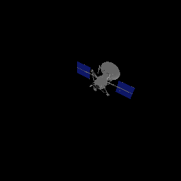
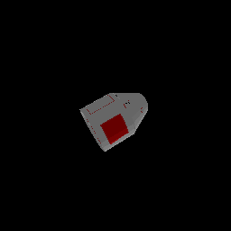
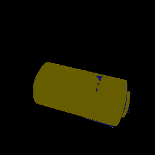
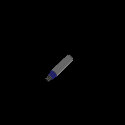

# SNCOAT
Space Non-Cooperative Object Active Tracking, which means the spacecraft approach to an unknown target only with vision camera. We propose an end-to-end active visual tracking method based on deep Q-learning algorithm, named as DRLAVT. It can guide the chasing spacecraft approach to arbitrary space non-cooperative target merely relied on color or RGBD images, which significantly outperforms PBVS method. 

See more details about SNCOAT benchmark in [Space Non-Cooperative Object Active Tracking With Deep Reinforcement Learning](https://doi.org/10.1109/TAES.2022.3211246).

If you use our benchmark or related codes, please cite:
```
@article{zhou2022space,
  title={Space Non-cooperative Object Active Tracking with Deep Reinforcement Learning},
  author={Zhou, Dong and Sun, Guanghui and Lei, Wenxiao and Wu, Ligang},
  journal={IEEE Transactions on Aerospace and Electronic Systems},
  year={2022},
  publisher={IEEE}
}
```

**MORE SOURCE CODES ARE COMING SOON ...**

  
  

# Requirement
- PyTorch ~= 1.6.0
- [CoppeliaSim v4.2](https://www.coppeliarobotics.com/downloads)
- [PyRep](https://github.com/stepjam/PyRep)
- gym
- matplotlib

\[Note\]: This Program only validated on Ubuntu16.04 and Centos7 platform.

# Simulated Env
## Scenes

Download scenes at first: 
[Googel Drive](https://drive.google.com/file/d/1-VpeZhVGYLrx1bWJviOI3IqnLeIrJvUS/view?usp=sharing) | [Baidu NetDisk](https://pan.baidu.com/s/1rNGd-fmT_BkG418yqxCSgg)(code:1111)

We construct 18 scenes with different types of space non-cooperative object, including asteroids, capsules, rockets, satellites, and stations. $\frac{2}{3}$ targets are used for training, the others for evaluation. 

- SNCOAT-Asteroid-(v0-v5)
- SNCOAT-Capsule-(v0-v2) 
- SNCOAT-Rocket-(v0-v2) 
- SNCOAT-Satellite-(v0-v2)
- SNCOAT-Station-(v0-v2)


## Try Simulated Env
[Get start with Simulated Env](https://github.com/Dongzhou-1996/SNCOAT/blob/main/Envs/start_with_SNCOAT_Env.md)


# PBVS Baseline Algorithm
The list of Trackers have been validated in our PBVS framework:
- SiamRPN
- SiamFC
- KCF


## Run PBVS based on KCF Tracker

## Run PBVS based on SiamRPN Tracker


# DRLAVT Algorithm
## Evaluate DRLAVT with Pretrained Model

## Train DRLAVT from scratch


